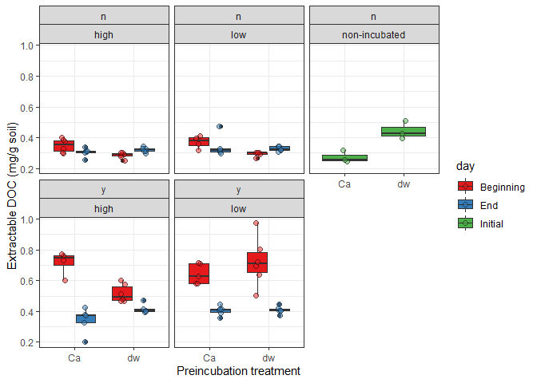
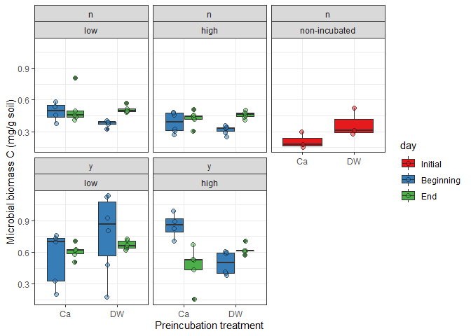
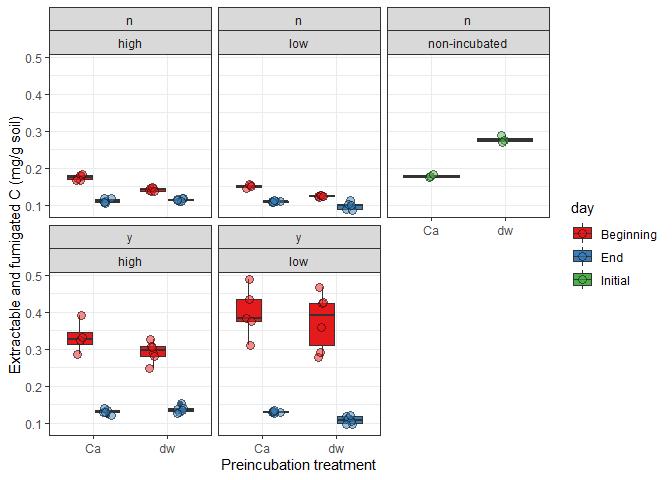

2020-11-28

  - [K2SO4 0.05 M Extractable DOC](#k2so4-0.05-m-extractable-doc)
  - [Microbial biomass C](#microbial-biomass-c)
  - [Extracted and fumigated C](#extracted-and-fumigated-c)

## K2SO4 0.05 M Extractable DOC

<!-- -->

1.  DOC was higher at the beginning than at the end of the incubation
    when litter was added, probably as a result of litter decomposition.
    When no litter was added, DOC was similar at the beginning and end
    of the incubation.

2.  Ca preincubation increased the early stage DOC concentration
    relative to the DW preincubation, except for the low water
    content+litter treatment. Perhaps because the water content was not
    high enough to sustain the amount of activity the led to the
    decrease in DOC. This is surprising, as Ca is thought to involve
    binding of DOC to minerals and reduce its availability. Here, Ca may
    have mediated microbial activity (?)

3.  At the end of the experiment DOC did not differ between water
    contents or preincubation treatment for the litter (\~0.4 mg C/g
    soil) and no litter (\~0.3 mg C/g soil).

4.  In the non-incubated controls, Ca preincubation treatment decreased
    DOC concentration compared to preincubation with DW. This could
    suggest the hypothesized role of Ca in DOC binding. Even though, DOC
    in the incubated soil was often higher in the soils preincubated
    with Ca, dominating over DOC binding by Ca. It may even be the case
    that had this not been the case the differences in DOC between DW
    and Ca were higher. On the other hand, it could be the result of the
    preincubating process itself. Ca-soils had to be leached many more
    times to achieve the same EC, and perhaps more C was washed out as
    well.

## Microbial biomass C

    ## Warning: Removed 3 rows containing non-finite values (stat_boxplot).

    ## Warning: Removed 3 rows containing missing values (geom_point).

<!-- -->

1.  When no litter was added, MBC was higher at the end of the
    incubation that at the beginning increased with DW preincubaion, but
    was not different with Ca preincubation. Thus, MBC was somewhat
    higher with Ca than with DW at the beginning. MBC could have
    increased with time as more SOC was decomposed and made available.
    With CA MBC was as high at the beginning of the incubation as it was
    in the end.

2.  When litter was added at higher water content, early stage MBC in
    the Ca preincubated soils was higher than with DW, and then evened
    out. At lower water content, no differences in MBC were detected.
    The lack of difference in MBC and DOC in the +litter/low water
    content treatment may be the result of a lack of water to sustain
    the elevated microbial activity achieved when preincubated with Ca
    at higher water content.

3.  MBC of Ca preincubated but non-incubated soils was lower than that
    of DW. Is this the result of lower extraction efficiency in the
    presence of elevated Ca, or did the more intensive leaching of
    Ca-preincubated soils remove more dissolved C and nutrients needed
    to sustain microbial growth.

## Extracted and fumigated C

<!-- -->
